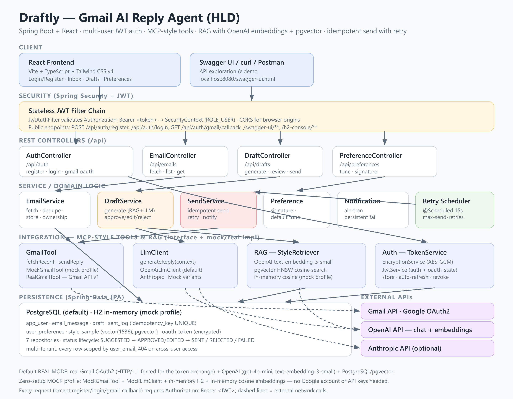

# Draftly — Gmail AI Reply Agent

> A full-stack AI assistant that reads your inbox, drafts replies **in your own
> writing style**, lets you review them, and sends them safely — Spring Boot
> API + React frontend, with multi-user accounts and real Gmail integration.

This is my capstone project for the **Airtribe Backend AI Engineering** course.
It brings together the core topics from the program: REST API design,
databases, layered architecture, LLD/HLD, authentication, and AI (**RAG** +
**MCP** concepts) — plus a small frontend to make the review workflow usable
end-to-end.



---

## ✨ What it does

- **Multi-user accounts** — register/login with email + password (JWT), each
  user's inbox, drafts, style history, and Gmail connection are fully isolated.
- **Fetches** inbox emails (Gmail API + OAuth2, or a built-in mock inbox).
- **Generates** AI reply drafts in multiple tones — *formal*, *concise*, *friendly*.
- **Learns your style** from past sent emails using **RAG** (OpenAI embeddings +
  pgvector similarity search).
- **Human-in-the-loop review**: approve, edit, or reject before anything is sent.
- **Sends** approved replies on the correct thread (`In-Reply-To` / `threadId`).
- **Logs** every draft and send with a status, as an audit trail.
- **Reliable sending**: idempotent (no duplicate emails) + automatic retries +
  a notification when sending keeps failing (e.g. an expired token).
- **Secure**: passwords are BCrypt-hashed, sessions are stateless JWTs, and
  Gmail OAuth tokens are **encrypted at rest** (AES-GCM).
- **React frontend** for the whole review workflow — login, inbox, draft
  review/approve/edit/reject/send, and preferences.

---

## 🚀 Quick start

Draftly runs in **real mode by default**: real Gmail (OAuth2), a real LLM
(OpenAI by default), RAG over PostgreSQL + pgvector, and JWT-based accounts.

### 1. Backend

#### Option A — Real mode with Docker (recommended)

```bash
cp .env.example .env      # then fill in OPENAI_API_KEY + your Google OAuth creds
docker compose up --build
```

This starts PostgreSQL (with the `pgvector` extension) and the app together.
On first boot a demo account is seeded:

> **Demo login:** `demo.user@draftly.app` / `demo1234`
> (or register your own account via `POST /api/auth/register`)

Then:

1. Log in (via the frontend, or `POST /api/auth/login`) to get a JWT.
2. Connect Gmail **once**: call `GET /api/auth/gmail/login` with your JWT,
   open the returned consent URL, approve, and you'll be redirected back as
   "connected".
3. Run the flow below.

> See "Google Cloud setup" in [`docs/HLD.md`](docs/HLD.md) and the
> "Configuration" section here for exactly what to put in `.env`.

#### Option B — Mock mode (no accounts, zero setup)

Don't have credentials yet? Run everything against a fake inbox + mock LLM +
an in-memory H2 database + in-memory similarity search — no Google account,
no API key:

```bash
# Local:
./mvnw spring-boot:run -Dspring-boot.run.profiles=mock      # macOS / Linux
mvnw.cmd spring-boot:run "-Dspring-boot.run.profiles=mock"  # Windows

# Or with Docker: add SPRING_PROFILES_ACTIVE=mock to your .env, then:
docker compose up --build
```

> Requires Java 17+. The `./mvnw` wrapper downloads Maven automatically the first
> time. To build a jar: `./mvnw clean package` then `java -jar target/*.jar`.

### 2. Frontend

```bash
cd frontend
npm install
npm run dev
```

Open **<http://localhost:5173>** and log in with the demo account above (or
register). The Vite dev server proxies `/api/**` calls to the backend on
`http://localhost:8080`.

For a production build: `npm run build` outputs static assets to
`frontend/dist/` — serve them with any static host, and add that origin to
`DRAFTLY_CORS_ALLOWED_ORIGINS`.

---

## 🎬 Try the full flow with curl

Prefer the frontend or Swagger UI (`/swagger-ui.html`, with the "Authorize"
button) for an interactive walkthrough. With curl, log in first and reuse the
token:

```bash
# 0. Log in (seeded demo account, or your own via /api/auth/register)
TOKEN=$(curl -s -X POST "http://localhost:8080/api/auth/login" \
  -H "Content-Type: application/json" \
  -d '{"email":"demo.user@draftly.app","password":"demo1234"}' | jq -r .token)

# 1. Fetch the inbox (real Gmail, or the fake inbox in mock mode)
curl -X POST "http://localhost:8080/api/emails/fetch?max=10" \
  -H "Authorization: Bearer $TOKEN"

# 2. See the emails
curl "http://localhost:8080/api/emails" -H "Authorization: Bearer $TOKEN"

# 3. Generate a friendly reply to email #1 (RAG + LLM happen here)
curl -X POST "http://localhost:8080/api/drafts" \
  -H "Authorization: Bearer $TOKEN" -H "Content-Type: application/json" \
  -d '{"emailId": 1, "tone": "friendly"}'

# 4. Approve the draft
curl -X POST "http://localhost:8080/api/drafts/1/approve" -H "Authorization: Bearer $TOKEN"

# 5. Send it (mock mode tip: add ?simulateFailures=2 to demo retry + idempotency)
curl -X POST "http://localhost:8080/api/drafts/1/send" -H "Authorization: Bearer $TOKEN"

# 6. Check status
curl "http://localhost:8080/api/drafts/1" -H "Authorization: Bearer $TOKEN"
```

Full endpoint reference: [`docs/API.md`](docs/API.md).

---

## 🔐 Authentication & multi-user

Every account is fully isolated — emails, drafts, style history, preferences,
and Gmail tokens are all scoped to the owning user; cross-user access to a
resource by id returns `404` (not `403`, to avoid leaking existence).

- `POST /api/auth/register` `{email, password}` → creates an account
  (BCrypt-hashed password) and returns `{token, email}`.
- `POST /api/auth/login` `{email, password}` → returns the same `{token,
  email}` shape.
- Every other `/api/**` endpoint requires `Authorization: Bearer <token>`
  (a stateless JWT, validated on each request by a Spring Security filter —
  no server-side sessions).
- **Per-user Gmail OAuth**: `GET /api/auth/gmail/login` (authenticated)
  returns a Google consent URL whose `state` parameter is a short-lived,
  signed JWT identifying *you*. `GET /api/auth/gmail/callback` is an
  unauthenticated browser redirect from Google — it decodes that `state` to
  know which account to attach the resulting tokens to.
- `GET /api/auth/status` / `POST /api/auth/logout` check/revoke your Gmail
  connection.

---

## 🧠 How the AI parts work

### RAG — learning your writing style

1. On startup, a few of "my" past sent emails are indexed as **style samples**.
2. When you generate a reply, Draftly **embeds** the incoming email (OpenAI
   `text-embedding-3-small` by default) and retrieves the **top-K most
   similar** past emails via **pgvector** HNSW cosine search.
3. Those samples + the chosen tone + your signature are built into a prompt for
   the LLM, so the reply sounds like you.
4. **Learning loop**: every successfully sent reply is indexed back into the
   style store, so the system keeps improving.

> Both the embedder and the vector store sit behind interfaces
> (`EmbeddingClient`, `vector-store: pgvector | memory`). The **mock profile**
> swaps in a dependency-free hashing embedder + in-Java cosine search, so RAG
> still works with zero setup.

### MCP-style tools

The course covered **MCP (Model Context Protocol)** — giving a model
well-defined *tools*. Draftly mirrors that idea: **Gmail** and the **LLM**
each sit behind a small tool interface (`GmailTool`, `LlmClient`), selected at
runtime by config. Gmail has `mock` and `real` implementations; the LLM has
**three** interchangeable providers — **`openai`** (default, `gpt-4o-mini`),
**`anthropic`**, and **`mock`**. The business logic never depends on a
specific vendor, so adding a provider is just one new class plus a config
value.

---

## 🏗️ Architecture & design

A layered Spring Boot API behind a stateless JWT security filter, with a React
SPA on top:

| Layer | Responsibility |
|-------|----------------|
| **Frontend** | React SPA — auth, inbox, draft review, preferences |
| **Security** | Spring Security + JWT filter chain, CORS, BCrypt |
| **Controllers** | REST endpoints, validation, DTO mapping |
| **Services** | Business logic: drafting, review, sending, retries |
| **Integration** | MCP-style tools (Gmail, LLM), RAG (OpenAI embeddings + pgvector), token encryption |
| **Persistence** | Spring Data JPA → PostgreSQL + pgvector (default) / H2 (mock profile) |

The full write-up is in [`docs/HLD.md`](docs/HLD.md).

**Draft status lifecycle:**
`SUGGESTED → APPROVED | EDITED → SENT`, with `REJECTED` and `FAILED` as the
other outcomes.

---

## 🔁 Reliability & security highlights

- **Stateless JWT auth** — BCrypt-hashed passwords; HMAC-signed JWTs for both
  login sessions and the Gmail OAuth `state` parameter.
- **Multi-tenant isolation** — every row is scoped by `user_email`; ownership
  is checked on every by-id lookup.
- **Idempotency** — a `UNIQUE` idempotency key in `sent_log` plus a pre-send check
  means retrying a send never creates a duplicate email.
- **Retries** — a `@Scheduled` job retries failed sends every 15s up to a capped
  number of attempts, then raises a notification.
- **Token encryption** — Gmail OAuth tokens stored with **AES/GCM**; access
  tokens auto-refresh; logout revokes them.
- **Quota-friendly** — emails are de-duplicated on fetch via the Gmail message id.

---

## 🛠️ Tech stack

**Backend** — Java 17 · Spring Boot 3.3 · Spring Security 6 (JWT via `jjwt`) ·
Spring Data JPA · PostgreSQL + `pgvector` (default) / H2 (mock profile) ·
springdoc-openapi (Swagger UI) · Docker · JUnit 5.

**Frontend** — React 19 · TypeScript · Vite · Tailwind CSS v4 · React Router ·
axios.

---

## ⚙️ Configuration

Real mode is the default. Copy `.env.example` to `.env` and fill in the values
below (compose auto-loads `.env`):

| Variable | Default | Purpose |
|----------|---------|---------|
| `DRAFTLY_GMAIL_MODE` | `real` | `real` or `mock` Gmail |
| `DRAFTLY_LLM_PROVIDER` | `openai` | `openai`, `anthropic`, or `mock` |
| `DRAFTLY_EMBEDDING_PROVIDER` | `openai` | `openai` or `hashing` (RAG style-sample embeddings) |
| `DRAFTLY_VECTOR_STORE` | `pgvector` | `pgvector` or `memory` (RAG similarity search) |
| `OPENAI_API_KEY` | — | **required** when LLM/embedding provider is `openai` |
| `OPENAI_MODEL` | `gpt-4o-mini` | OpenAI chat model to use |
| `ANTHROPIC_API_KEY` | — | needed when `DRAFTLY_LLM_PROVIDER=anthropic` |
| `GOOGLE_CLIENT_ID` / `GOOGLE_CLIENT_SECRET` | — | **required** for real Gmail |
| `GOOGLE_REDIRECT_URI` | `…/api/auth/gmail/callback` | must match the Console |
| `DRAFTLY_ENCRYPTION_KEY` | demo key | **override in production** — AES key (Base64, 16/24/32 bytes) for OAuth tokens at rest |
| `DRAFTLY_JWT_SECRET` | demo key | **override in production** — HMAC-SHA256 key (Base64) for login + OAuth-state JWTs |
| `DRAFTLY_JWT_EXPIRATION_MINUTES` | `1440` | login JWT lifetime |
| `DRAFTLY_CORS_ALLOWED_ORIGINS` | `http://localhost:5173` | comma-separated browser origins allowed to call the API (frontend dev/prod URLs) |
| `POSTGRES_USER` / `POSTGRES_PASSWORD` | `draftly` | database credentials |
| `SPRING_PROFILES_ACTIVE` | — | set to `mock` for the zero-setup fallback |

**Switching to mock mode:** set `SPRING_PROFILES_ACTIVE=mock` (this swaps in H2 +
the fake inbox + the mock LLM + in-memory RAG, so no Postgres, Google account,
or API key is needed). See the Quick start above.

**Demo login** (seeded on first startup): `demo.user@draftly.app` / `demo1234`.

---

## 🧪 Tests

```bash
./mvnw test
```
Includes unit tests for JWT issuing/validation, the tone-aware draft
generator, and the RAG retrieval math (deterministic, no network).

---

## 📁 Project structure

```text
draftly/
├── src/main/java/com/airtribe/draftly/
│   ├── controller/   REST endpoints (Auth, Email, Draft, Preference)
│   ├── service/      business logic
│   │   ├── auth/     JWT issuing/validation, user details, AES token encryption ← Security
│   │   ├── gmail/    GmailTool (mock / real)                       ← MCP-style tool
│   │   ├── llm/      LlmClient (openai / anthropic / mock)         ← MCP-style tool
│   │   └── rag/      embeddings + pgvector/in-memory retrieval     ← RAG
│   ├── domain/       JPA entities (incl. User, all multi-tenant via user_email)
│   ├── repository/   Spring Data repositories
│   ├── dto/          request/response records
│   ├── exception/    error handling
│   ├── scheduler/    retry job
│   └── config/       security (JWT filter, CORS), properties, seeding, OpenAPI
├── frontend/         React + TypeScript + Tailwind SPA
│   └── src/
│       ├── api/         typed REST client (auth, emails, drafts, preferences)
│       ├── components/  shared UI (layout, route guard, status badges)
│       ├── context/     auth state
│       └── pages/        login, register, inbox, drafts, preferences
├── docs/             HLD, API reference, demo script, architecture diagram
├── Dockerfile        multi-stage build (backend)
└── docker-compose.yml
```

---

## 📹 Demo video

A step-by-step script (with narration and exact clicks) for the under-5-minute
video is in [`docs/DEMO_SCRIPT.md`](docs/DEMO_SCRIPT.md).

---

## 📝 Notes & limitations

This is a learning capstone, so a couple of things are intentionally
simplified: the **mock profile** falls back to a deterministic hashing
embedder and an in-Java cosine search instead of OpenAI embeddings + pgvector,
and the frontend isn't containerized yet (run `npm run dev`, or serve
`npm run build`'s output separately and point `DRAFTLY_CORS_ALLOWED_ORIGINS`
at it). Both the embedding/vector-store choice and the LLM/Gmail provider sit
behind interfaces, so they can be swapped without touching the core logic.
